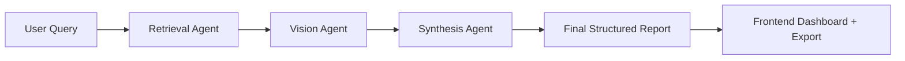

# Multimodal News Intelligence Agent

## 1) Project Overview
Multimodal News Intelligence Agent is a full-stack university-grade prototype that retrieves relevant news articles, analyzes article images, and synthesizes a transparent intelligence report. It implements a multi-agent pipeline:

**User Input → Retrieval Agent → Vision Agent → Synthesis Agent → Final Report**

## 2) Why This Project Matters
Modern news intelligence requires combining textual and visual signals, not just summarizing single articles. This project demonstrates source-traceable multi-agent orchestration with local-first AI tooling for reproducible classroom demos.

## 3) Core Features
- Query-driven news analysis workflow.
- Retrieval Agent using semantic ranking (default embedding model: `all-mpnet-base-v2`).
- Vision Agent producing structured visual context fields.
- Synthesis Agent generating a polished report with transparent evidence.
- Source URLs shown throughout UI.
- Markdown export + printable report view.
- Mock mode for deterministic demos without paid APIs.

## 4) System Architecture
- **Frontend (React + TypeScript + Tailwind):** dashboard for query input, retrieval cards, visual findings, and report rendering.
- **Backend (FastAPI):** API routes, orchestrator, agents, schemas, and service adapters.
- **Data layer:** sample dataset (JSON + images), local vector ranking flow, optional OpenAI/Ollama synthesis providers.



## 5) Multi-Agent Workflow
1. User submits a natural-language query and max article count.
   Users can choose a quick brief or an in-depth report mode.
2. Retrieval Agent ranks source articles by semantic relevance.
3. Vision Agent analyzes article visual context and returns structured fields.
4. Synthesis Agent combines text + visual evidence into report sections.
5. Frontend displays report with source links and export actions.

## 6) Tech Stack
- Backend: FastAPI, Pydantic, NumPy, pytest
- Frontend: React, TypeScript, Vite, Tailwind, Vitest
- Retrieval: sentence-transformers (`all-mpnet-base-v2`) with hash fallback
- Vision: heuristic fallback plus OpenAI-compatible multimodal analysis
- Synthesis: OpenAI GPT adapter, Ollama adapter, and mock fallback
- Storage: local files, in-memory vector ranking (Chroma-ready config)

## 7) Free Local Setup
This repository is designed to run **without paid APIs**.

### Model defaults
- Retrieval: `sentence-transformers/all-mpnet-base-v2`
- Vision: local heuristic fallback or OpenAI-compatible multimodal vision
- Synthesis: OpenAI GPT (`gpt-4o-mini`) or Ollama local model (`llama3.1:8b`)

### Ollama (Windows + Linux)
1. Install Ollama from the official installer/package.
2. Start Ollama service.
3. Verify:
   - `ollama list`
   - `curl http://localhost:11434/api/tags`
4. Pull model:
   - `ollama pull llama3.1:8b`

If you skip OpenAI/Ollama providers, set `MOCK_MODE=true`.

## 8) Repository Structure
```text
multimodal-news-intelligence-agent/
├── backend/
│   ├── app/
│   │   ├── agents/
│   │   ├── api/
│   │   ├── core/
│   │   ├── models/
│   │   ├── services/
│   │   └── utils/
│   ├── tests/
│   ├── requirements.txt
│   └── pyproject.toml
├── frontend/
│   ├── src/
│   │   ├── api/
│   │   ├── components/
│   │   └── types/
├── sample_data/
├── docs/
├── .env.example
└── README.md
```

- `backend/app/agents`: RetrievalAgent, VisionAgent, SynthesisAgent.
- `backend/app/services/orchestrator.py`: pipeline coordinator.
- `sample_data/`: deterministic demo articles and images.
- `docs/`: architecture, API, demo, troubleshooting guides.

## 9) Prerequisites
- Python 3.11+
- Node.js 20+
- npm 10+
- (Optional) OpenAI API key for GPT synthesis or Ollama for local synthesis model

## 10) Environment Variables
Copy `.env.example` to `.env`. All variables:

| Variable | Required | Example | Purpose |
|---|---|---|---|
| APP_NAME | Optional | Multimodal News Intelligence Agent | FastAPI app display name |
| APP_ENV | Optional | development | runtime environment |
| APP_HOST | Optional | 0.0.0.0 | backend bind host |
| APP_PORT | Optional | 8000 | backend port |
| FRONTEND_ORIGIN | Optional | http://localhost:5173 | CORS origin |
| MOCK_MODE | Optional | true | enables deterministic mock mode |
| SAMPLE_DATA_PATH | Optional | sample_data/articles.json | local dataset path |
| LIVE_INGESTION_ENABLED | Optional | false | enables live ingestion routes and news provider fetch |
| NEWS_API_KEY | Optional |  | key used for live article ingestion |
| NEWS_API_BASE_URL | Optional | https://newsapi.org/v2 | live news provider base URL |
| NEWS_API_LANGUAGE | Optional | en | language filter for live ingestion |
| NEWS_API_PAGE_SIZE | Optional | 30 | max upstream fetch size per query |
| INGESTION_TIMEOUT_SECONDS | Optional | 12 | timeout for news provider requests |
| INGESTION_EXTRACT_FULL_TEXT | Optional | true | enables article URL text extraction fallback |
| INGESTION_ARTICLE_TIMEOUT_SECONDS | Optional | 8 | timeout for article page extraction requests |
| INGESTION_PLACEHOLDER_IMAGE_URL | Optional | https://via.placeholder.com/1280x720?text=No+Image | fallback image URL when source image is missing |
| EMBEDDING_MODEL_NAME | Optional | sentence-transformers/all-mpnet-base-v2 | retrieval embedding model |
| VECTOR_DB_PATH | Optional | backend/.chroma | local vector db path |
| VECTOR_STORE_BACKEND | Optional | memory | vector backend selection (`memory` or `pgvector`) |
| VECTOR_STORE_DATABASE_URL | Optional |  | PostgreSQL connection string for pgvector mode |
| VECTOR_STORE_TABLE_NAME | Optional | article_embeddings | table used for embedding persistence |
| VECTOR_STORE_DIMENSION | Optional | 32 | embedding vector dimension for pgvector table |
| VISION_PROVIDER | Optional | local | vision provider mode |
| CLIP_MODEL_NAME | Optional | ViT-B-32 | OpenCLIP model name |
| CLIP_PRETRAINED | Optional | laion2b_s34b_b79k | OpenCLIP weights |
| SYNTHESIS_PROVIDER | Optional | openai | synthesis backend (`openai` or `ollama`) |
| OPENAI_BASE_URL | Optional | https://api.openai.com/v1 | OpenAI API base URL |
| OPENAI_API_KEY | Optional | sk-... | OpenAI API key used for GPT synthesis |
| OPENAI_MODEL | Optional | gpt-4o-mini | OpenAI model for synthesis |
| OPENAI_VISION_MODEL | Optional | gemini-3.1-flash-lite-preview | overrides the multimodal vision model; falls back to `OPENAI_MODEL` when omitted |
| OLLAMA_BASE_URL | Optional | http://localhost:11434 | local Ollama endpoint |
| OLLAMA_MODEL | Optional | llama3.1:8b | synthesis model |

In mock mode, OpenAI/Ollama model vars may be omitted.

## 11) Local Setup for Windows
### Windows (PowerShell)
```powershell
cd backend
python -m venv .venv
.\.venv\Scripts\Activate.ps1
pip install -r requirements.txt
cd ..
copy .env.example .env
```

If PowerShell blocks activation:
```powershell
Set-ExecutionPolicy -Scope Process -ExecutionPolicy Bypass
```

### Windows (Command Prompt)
```cmd
cd backend
python -m venv .venv
.venv\Scripts\activate.bat
pip install -r requirements.txt
cd ..
copy .env.example .env
```

Frontend:
```powershell
cd frontend
npm install
cd ..
```

## 12) Local Setup for Linux
```bash
cd backend
python3 -m venv .venv
source .venv/bin/activate
pip install -r requirements.txt
cd ..
cp .env.example .env

cd frontend
npm install
cd ..
```

## 13) Running the Backend
From repository root:

Windows PowerShell:
```powershell
cd backend
.\.venv\Scripts\Activate.ps1
uvicorn app.main:app --reload --host 0.0.0.0 --port 8000
```

Linux:
```bash
cd backend
source .venv/bin/activate
uvicorn app.main:app --reload --host 0.0.0.0 --port 8000
```

## 14) Running the Frontend
```bash
cd frontend
npm run dev
```
Open: `http://localhost:5173`

## 15) Running the Full App
- Backend: `http://localhost:8000`
- Frontend: `http://localhost:5173`
- Run each in separate terminal windows.

## 16) Running in Mock / Demo Mode
Set in `.env`:
```env
MOCK_MODE=true
```
Then run backend + frontend normally. The pipeline uses `sample_data/articles.json` and deterministic visual + synthesis outputs.

## 16a) Running with Live News Ingestion

To switch from sample data to real-time NewsAPI.org articles, set these three variables in `.env`:

```env
NEWS_API_KEY=<your_newsapi_key>
LIVE_INGESTION_ENABLED=true
INGESTION_EXTRACT_FULL_TEXT=false   # omit newspaper3k scraping for speed
```

Then start the backend and trigger ingestion:

```bash
# kick off a background ingestion job
curl -X POST http://localhost:8000/api/ingest \
     -H "Content-Type: application/json" \
     -d '{"query": "AI breakthroughs", "max_articles": 10}'

# poll until status == "completed"
curl http://localhost:8000/api/status/<task_id>
```

Once completed, run `POST /api/analyze` as normal — the retrieved articles will be drawn from the live-ingested vectors.

Get a free NewsAPI key at <https://newsapi.org/register>. The free tier allows 100 requests/day.

## 16b) Running Gemini Vision

To enable real multimodal image analysis with a Gemini OpenAI-compatible endpoint, set:

```env
MOCK_MODE=false
VISION_PROVIDER=openai
OPENAI_BASE_URL=https://generativelanguage.googleapis.com/v1beta/openai
OPENAI_API_KEY=<your_gemini_key>
OPENAI_MODEL=gemini-3.1-flash-lite-preview
# optional: keep vision on a separate model
OPENAI_VISION_MODEL=gemini-3.1-flash-lite-preview
```

When `VISION_PROVIDER=local`, the backend uses heuristic visual summaries. When `VISION_PROVIDER=openai`, it downloads the article image server-side and sends it to the configured multimodal model.

## 17) Running Tests
Backend:
```bash
cd backend
pytest
```

Frontend:
```bash
cd frontend
npm test
```

Integration demo call:
```bash
curl -X POST http://localhost:8000/api/analyze \
  -H "Content-Type: application/json" \
  -d '{"query":"Red Sea shipping disruptions","max_articles":5}'
```

## 18) Example User Workflow
1. Open frontend dashboard.
2. Enter query: `What are the latest developments in Red Sea shipping disruptions?`
3. Click **Run Pipeline**.
4. Inspect retrieval cards (title/source/date/url/relevance).
5. Inspect vision insights (theme, visual elements, relevance).
6. Review structured final report.
7. Export Markdown report.

## 19) Sample Inputs and Expected Outputs
- Input: `Summarize recent AI regulation news`
- Expected output:
  - top ranked governance/policy articles,
  - structured visual context,
  - final report sections (executive summary, themes, tensions, uncertainty),
  - linked source list.

## 20) API Overview
- `GET /api/health` → health status
- `POST /api/analyze` → full pipeline response
- `POST /api/ingest` → queue live ingestion task
- `GET /api/status/{task_id}` → ingestion job status

See `docs/api.md` for request/response details.

## 21) Troubleshooting
See `docs/troubleshooting.md` for Windows/Linux fixes including Python path, venv, npm, ports, CORS, and model availability issues.

## 22) Future Improvements
- Additional provider adapters beyond current News API ingestion.
- Full PostgreSQL article metadata persistence and hybrid SQL+vector retrieval.
- Full OpenCLIP inference with image embeddings and zero-shot labels.
- Chroma persistent vector indexing for larger corpora.
- PDF export endpoint.
- Historical query/report storage in SQLite.

## 23) Team Responsibility Mapping
- **Coby:** pipeline integration + synthesis orchestration.
- **Jase:** retrieval ranking + content normalization.
- **Court:** vision analysis and structured visual findings.
- **Jakob:** frontend dashboard and report presentation.

## 24) Validation Notes
Verified in this implementation:
- Python syntax compilation executed (`python -m compileall backend/app frontend/src`).
- Full dependency install, backend pytest, frontend vitest/build were not executable in this sandbox due package registry/network restrictions.

If local model runtimes are not installed, run in mock mode first.
