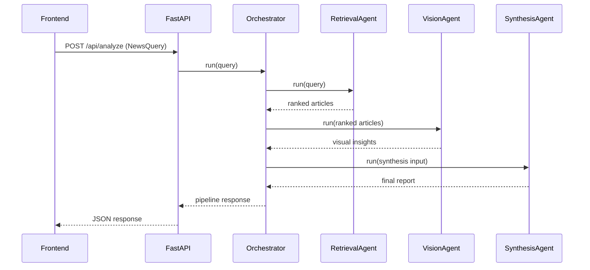

# Architecture

## High-level design
The backend implements a strict multi-agent orchestration pipeline:

1. `RetrievalAgent` ranks articles via embedding similarity.
2. `VisionAgent` returns structured visual findings for each selected article image.
3. `SynthesisAgent` combines text + visual evidence into a transparent report.
4. `NewsPipelineOrchestrator` manages sequencing and schema-safe handoffs.

## Schema boundaries
All data contracts use Pydantic in `backend/app/models/schemas.py`.
Key models:
- `NewsQuery`
- `ArticleSource`
- `RankedArticle`
- `VisualInsight`
- `SynthesisInput`
- `FinalReport`
- `ReportSection`
- `ConfidenceAssessment`

## Source transparency
Each report section contains evidence references (article title + URL), and the final report includes a source list rendered in the UI.

## Mode behavior
- **Mock mode (`MOCK_MODE=true`)**: deterministic embeddings, visual findings, and synthesis text using local sample data.
- **Local model mode (`MOCK_MODE=false`)**: sentence-transformers + Ollama path enabled (OpenCLIP-ready via vision provider abstraction).
