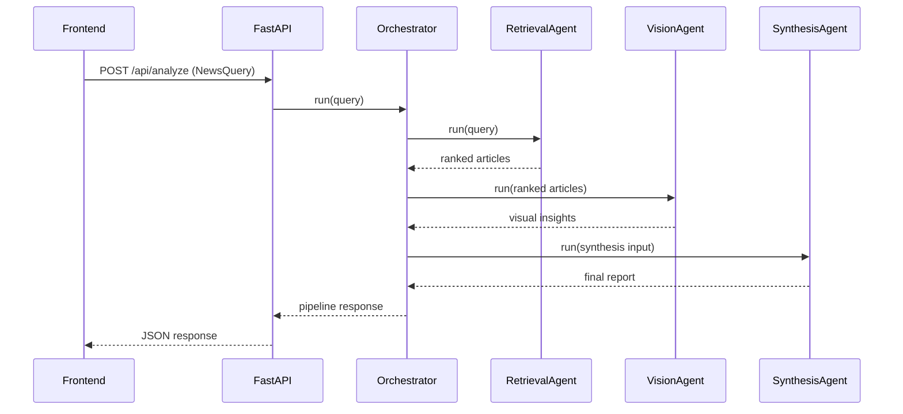

# Architecture

## High-level design
The backend implements a strict multi-agent orchestration pipeline:

1. `RetrievalAgent` indexes sample or live-ingested articles and ranks them via embedding similarity.
2. `VisionAgent` returns structured visual findings for each selected article image.
3. `SynthesisAgent` combines text + visual evidence into a transparent report.
4. `NewsPipelineOrchestrator` manages sequencing and schema-safe handoffs.

## Live ingestion path
When live mode is enabled (`LIVE_INGESTION_ENABLED=true`), the retrieval layer fetches live articles from NewsAPI.org before ranking:

```mermaid
flowchart LR
	Q["User Query<br/>(subject, dates)"] --> I["NewsIngestionService<br/>(NewsAPI fetch)"]
	I --> N["Article Normalization<br/>(title, source, date, content)"]
	N --> E["Full-Text Extraction<br/>(newspaper3k or HTTP)"]
	E --> D["URL Deduplication<br/>(ensure uniqueness)"]
	D --> V["Embed & Store<br/>(vector_store.upsert)"]
	V --> R["RetrievalAgent.run()<br/>(search & rank)"]
	R --> RA["RankedArticles<br/>(to Vision/Synthesis)"]
```

### Ingestion Modes

1. **Synchronous** (default): Ingestion happens before each query
   - Called automatically in `RetrievalAgent.run()` 
   - Blocks query response until complete
   - Suitable for single-user or light-traffic scenarios
   - Endpoint: `POST /api/analyze`

2. **Asynchronous** (background job): Ingestion queued as background task
   - Non-blocking - returns task_id immediately
   - Poll status via `/api/status/{task_id}`
   - Suitable for large/slow queries or high concurrency
   - Endpoint: `POST /api/ingest`

### Vector Backend Options

- **`memory`** (default): In-memory numpy arrays
  - Zero setup needed
  - Fast for <10k articles
  - Data lost on restart
  - Best for development/testing

- **`pgvector`** (production): PostgreSQL with vector extension
  - Persistent storage across restarts
  - Scales to millions of articles
  - Requires database setup
  - Automatic fallback to memory if unavailable
  - See [Live Ingestion Guide](./live-ingestion-implementation.md) for setup

### Key Components

- **NewsIngestionService**: Fetches from NewsAPI, normalizes metadata, extracts full text
- **RetrievalAgent**: Orchestrates ingestion, embedding, and ranking
- **Vector Store Abstraction**: Pluggable backend for similarity search
- **IngestionTaskStore**: Tracks async job state and progress
- **URL Deduplication**: Prevents duplicate articles using SHA1(url) hash

See [Live Ingestion Implementation Guide](./live-ingestion-implementation.md) for complete details.

## Schema boundaries
All data contracts use Pydantic in `backend/app/models/schemas.py`.
Key models:
- `NewsQuery`
- `ArticleSource`
- `RankedArticle`
- `VisualInsight`
- `SynthesisInput`
- `FinalReport`
- `ReportSection`
- `ConfidenceAssessment`

## Source transparency
Each report section contains evidence references (article title + URL), and the final report includes a source list rendered in the UI.

## Mode behavior
- **Mock mode (`MOCK_MODE=true`)**: deterministic embeddings, visual findings, and synthesis text using local sample data.
- **LLM mode (`MOCK_MODE=false`)**: sentence-transformers + provider-based synthesis (`openai` GPT or `ollama`) with schema-safe fallback.
- **Live ingestion enabled (`LIVE_INGESTION_ENABLED=true`)**: retrieval can fetch live articles, extract full text, and queue ingestion jobs via `/api/ingest`.
